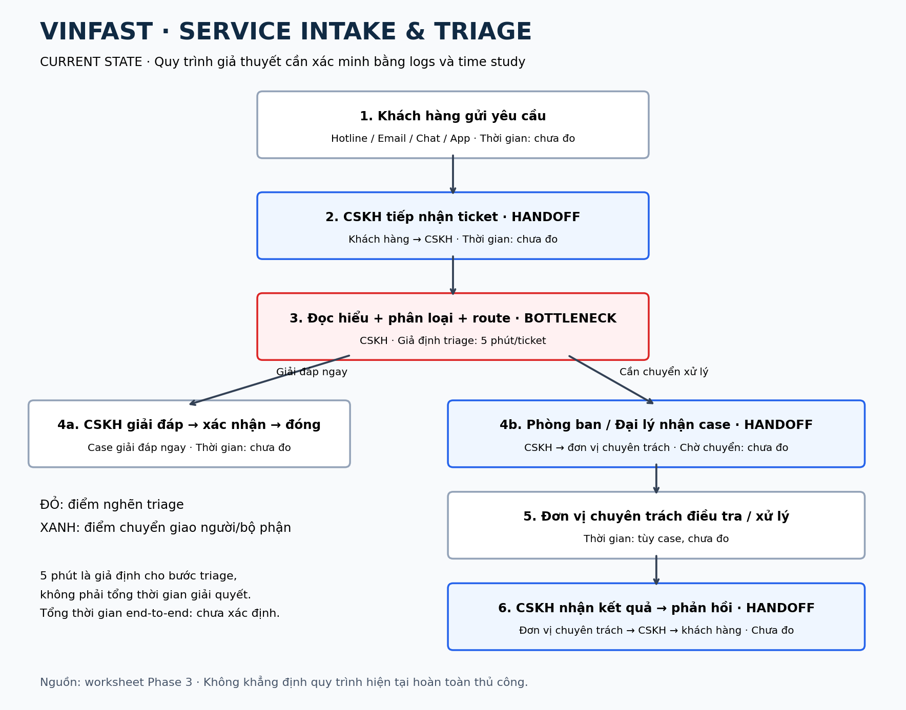

# Deep-Dive Report — VinFast AI Service Intake & Triage Copilot

# 🏗️ Phase 3 — DEEP-DIVE (Nhóm, 85 min)

## Đề tài được chọn: VinFast AI Service Intake & Triage Copilot

### Vì sao chọn bài này thay vì Xanh SM Dispatch?

Xanh SM Dispatch có tiềm năng tác động rất cao, nhưng phần dự báo và tối ưu điều phối chủ yếu thuộc các bài toán forecasting, optimization, graph/geospatial ML và operations research.

Trong khi đó, Phase 4 của Lab yêu cầu nhóm chứng minh system prompt, structured output, operational boundary và adversarial prompting. **Service Triage phù hợp trực tiếp hơn với việc thử nghiệm Gemini 2.5 Flash**, giúp thể hiện năng lực AI Product Scoping mà không ép LLM giải bài toán tối ưu hóa vốn không cần LLM.

## 3.1. Current-State Workflow Mapping (25 min)

Quy trình CSKH được mô tả theo cấu trúc tiếp nhận → phân loại/chuyển xử lý → phản hồi/xác nhận kết quả:

```text
Customer
   │
   ▼
Hotline / Email / Chat / App
   │
   ▼
🔄 CSKH tiếp nhận ticket
   │
   ▼
🔴 Đọc + hiểu + phân loại yêu cầu
   │  ⏱ Giả định triage: 5 phút/ticket
   │
   ├── Có thể giải đáp ngay ──> CSKH trả lời ──> Close
   │
   └── Chưa xử lý được
              │
              ▼
      🔄 Phòng ban / Đại lý
              │
              ▼
        Điều tra / xử lý
              │
              ▼
      🔄 CSKH nhận kết quả
              │
              ▼
        Phản hồi khách hàng
```

**Ký hiệu:** 🔴 Bottleneck; 🔄 Handoff giữa khách hàng, CSKH và đơn vị xử lý.

**Thời gian:** Baseline triage giả định là **5 phút/ticket**, nằm trong khoảng 3–5 phút của Quick Card #1. **Tổng thời gian toàn quy trình: chưa xác định**; cần đo thời gian từng bước và thời gian chờ chuyển giao bằng ticket logs/time study. Không coi 5 phút triage là tổng thời gian giải quyết ticket.

### Bottleneck được chọn

🔴 **Hiểu ticket + phân loại + route + tổng hợp context.**

Đây là bước phù hợp với LLM bởi đầu vào có thể gồm:

- Free text và email dài.
- Cách diễn đạt không chuẩn hoặc lỗi chính tả.
- Nhiều intent trong một ticket.
- Ảnh/tài liệu đính kèm.
- Nội dung cần tóm tắt trước khi handoff.

### Điều chưa được biết

Nguồn công khai **không chứng minh VinFast đang làm bước này hoàn toàn thủ công**. Cần bổ sung đường dẫn quy trình CSKH công khai để đối chiếu mô tả trên; mức tự động hóa và thời gian xử lý thực tế phải được xác minh bằng dữ liệu nội bộ.

> Chúng tôi giả thuyết rằng human triage tại bước phân loại/chuyển xử lý đang tạo ra chi phí đáng kể. Giả thuyết phải được xác nhận bằng ticket logs và time study trước khi đưa vào vận hành thực tế.

## 3.2. Problem Statement (6-field) & Metrics (15 min)

| Field | Nội dung chi tiết |
|---|---|
| **1. Actor / Operator** | Nhân viên Contact Center/CSKH và các đơn vị nhận ticket tiếp theo. |
| **2. Current Workflow** | Yêu cầu từ hotline, email, chat hoặc app được tiếp nhận; CSKH phân loại thành case có thể giải quyết ngay hoặc cần chuyển phòng ban/đại lý, sau đó theo dõi và xác nhận kết quả. Công cụ tiếp nhận, CRM và mức tự động hóa hiện tại cần được xác minh với đơn vị vận hành. |
| **3. Bottleneck** | Đọc free-text, lấy thông tin quan trọng, phân loại intent/severity và route đúng destination. Với ticket phức tạp, giả thuyết là bước này dễ chậm, thiếu context hoặc chuyển sai queue. |
| **4. Business Impact** | Chưa có số nội bộ công khai. Kịch bản giả định: 10.000 ticket/tháng × 5 phút triage ≈ **833 giờ công/tháng**. Nếu AI hỗ trợ 70% lượng ticket và giảm 80% thời gian trên nhóm đó → khoảng **467 giờ công/tháng** có thể được giải phóng. Đây là giả thuyết ước lượng quy mô, chưa phải kết quả đo thực tế. |
| **5. Success Metric** | Mục tiêu: ≥95% routing accuracy; safety-case recall ≥99%; median AI triage <10 giây; human triage <30 giây; không tăng reopen rate so với baseline; 0 safety case bị tự động đóng. |
| **6. Operational Boundary** | AI được summarize, classify, extract và recommend route; con người review trước khi chuyển xử lý. AI không được kết luận xe an toàn để tiếp tục chạy, từ chối/chấp thuận bảo hành, quyết định bồi thường, tự đóng safety case hoặc thay thế kỹ thuật viên chẩn đoán. Case an toàn hoặc không chắc chắn phải chuyển người có trách nhiệm/quy trình khẩn cấp hiện hữu. |

### Công thức ước lượng giờ công tiết kiệm

```text
HoursSaved = TicketVolume × BaselineTriageTime × AIEligibleRate × TimeReduction / 60
```

Trong đó `TicketVolume` tính bằng ticket/tháng và `BaselineTriageTime` tính bằng phút/ticket. Hai tỷ lệ được biểu diễn dưới dạng số thập phân.

```text
HoursSaved = 10.000 × 5 × 0,70 × 0,80 / 60
           ≈ 467 giờ công/tháng
```

Thay bốn biến bằng dữ liệu thật của VinFast trước khi ra quyết định đầu tư. Đây là ước lượng giờ công tiết kiệm, chưa phải ROI tài chính; ROI cần tính thêm chi phí nhân sự, API, tích hợp, vận hành và review.

## 3.3. Future-State Flow & AI Fit (25 min)

### AI Fit Matrix

| Approach | Có phù hợp? | Vì sao |
|---|---|---|
| **Rule-based** | ★★★☆☆ | Tốt với keyword, VIN pattern, DTC, category cố định và business rules rõ. Chi phí thấp, hành vi xác định. |
| **LLM Feature** | **★★★★★** | Tốt với mô tả tự nhiên, nhiều intent, lỗi chính tả, summarization, multilingual và extraction. |
| **Agentic Loop** | ★★☆☆☆ | Có thể hữu ích sau này nhưng POC ban đầu không cần tự chủ; tăng rủi ro tích hợp và vận hành. |

**Kiến trúc lựa chọn:** [x] Rule / State-Machine; [x] LLM Feature; [ ] Agentic Loop.

**Hybrid = Rules + LLM + Human.** Rules kiểm tra trường dữ liệu và quy tắc nghiệp vụ; LLM đọc hiểu, tóm tắt và đề xuất; con người phê duyệt và xử lý ngoại lệ.

### Future-State Flow

```text
Customer Request
      │
      ▼
Rules: kiểm tra định dạng / trường dữ liệu / tín hiệu an toàn
      │
      ▼
🔵 AI parse request
      │  Extract: VIN / model / symptom / location / intent
      ▼
🔵 Safety & Intent Classification
      │
      ├── Safety case / nghi ngờ an toàn ──> Safety path bên dưới
      │
      ├── Không đủ tin cậy / thiếu dữ liệu / lỗi AI ──┐
      │                                              ▼
      ▼                                       ↩️ FALLBACK
Routine case                                  Human triage
      │
      ▼
🔵 Suggested destination
   + summary + missing info
      │
      ▼
🟢 Human review
      │
      ├── Approve ──> Existing CRM / Dealer workflow
      ├── Correct ──> Sửa đề xuất rồi chuyển workflow hiện hữu
      └── Escalate ──> Người/bộ phận có thẩm quyền xử lý
```

**Ký hiệu:** 🔵 AI Step; 🟢 Human Step (HITL); ↩️ Fallback khi AI lỗi hoặc không đủ tin cậy.

### Safety path

```text
Rules hoặc AI phát hiện / nghi ngờ:
brake / steering / battery fire /
collision / immobilized vehicle /
critical safety uncertainty
            │
            ▼
Không tự xử lý hoặc kết luận xe an toàn
            │
            ▼
🟢 Human / existing emergency process
```

AI triage phải tuân theo quy trình khẩn cấp hiện hữu, không tự thay đổi hoặc thay thế luồng eCall/cứu hộ. Thông tin về dịch vụ cứu hộ 24/7 và SLA áp dụng cần được đối chiếu với tài liệu chính thức của VinFast trước khi dùng làm cam kết trong sản phẩm.

---

## Sơ đồ current-state đính kèm



# 🏁 Phase 5 — EVALUATE (Nhóm, 20 min)

## AI Readiness Checklist

| Hạng mục | Trạng thái | Việc cần hoàn tất |
|---|---|---|
| Dữ liệu mẫu/logs sạch | Chưa xác minh | Audit 4–8 tuần ticket, masking và kiểm tra nhãn. |
| Kiểm soát rủi ro | Có thiết kế, chưa kiểm chứng | Chạy bốn test VinFast và kiểm tra HITL/fallback. |
| Stakeholder chấp thuận | Chưa xác minh | Phỏng vấn CSKH, cố vấn dịch vụ và CRM owner. |

### 1. Có dữ liệu?

**Có khả năng, nhưng cần xác minh — chưa đánh dấu hoàn thành.**

Workflow tiếp nhận yêu cầu qua nhiều kênh gợi ý khả năng có các dữ liệu:

- Ticket text/transcript.
- Category và destination queue.
- Timestamps.
- Resolution và reopen.
- Customer response.

Không coi dữ liệu **chắc chắn có và sạch** trước khi data audit. Cần kiểm tra khả năng truy cập, chất lượng nhãn và độ đầy đủ của từng trường.

### 2. Rủi ro AI sai có kiểm soát được không?

**Có thể kiểm soát theo thiết kế**, nếu AI chỉ đưa ra recommendation và có fallback. Các quyết định nhạy cảm vẫn bắt buộc HITL.

Đây là điều kiện thiết kế, chưa phải kết luận đã được kiểm chứng: bốn test VinFast ở Phase 4 chưa có kết quả thực tế.

### 3. Stakeholder có thay đổi workflow được không?

**Chưa biết.** Cần phỏng vấn:

- Contact Center agents.
- Workshop service advisers.
- Customer-service operation manager.
- CRM/product owner.

## Quyết định cuối cùng

- [x] **GO — Prototype phạm vi hẹp.**
- [ ] **NOT YET — Trì hoãn toàn bộ prototype.**
- [ ] **NO-GO — Hủy bỏ dự án AI.**

**Phạm vi được chọn:**

> AI-assisted classification, summarization and routing with mandatory human review for safety/warranty/financial cases.

Quyết định GO áp dụng cho việc xây dựng và đánh giá POC có giám sát, chưa cho phép triển khai production hoặc một Autonomous Service Agent. Trong POC ban đầu, con người review đề xuất trước khi chuyển vào workflow hiện hữu như Phase 3.

### Justification

**Thứ nhất,** cấu trúc workflow được dùng để xây dựng giả thuyết là tiếp nhận yêu cầu qua nhiều kênh, phân loại thành case có thể trả lời ngay hoặc chuyển phòng ban/đại lý. Cần bổ sung nguồn quy trình CSKH chính thức của VinFast như đã ghi ở Phase 3.

**Thứ hai,** quy mô hậu mãi là lý do để kiểm chứng giá trị của cải thiện nhỏ. Số liệu đầu vào do người viết cung cấp là **hơn 175.000 ô tô bán tại Việt Nam trong năm 2025** và **khoảng 400 xưởng dịch vụ trong nước**. Hai số liệu này **chưa được xác minh/kèm nguồn trong worksheet**; cần đối chiếu công bố chính thức và thời điểm thống kê trước khi dùng làm bằng chứng. Số xe và xưởng không thay thế được số lượng ticket thực tế.

**Thứ ba,** bài toán có LLM fit rõ vì phần khó nằm ở hiểu ngôn ngữ tự nhiên, extraction, summarization và classification; business rules vẫn có thể được thực thi bằng code xác định.

**Thứ tư,** phạm vi tác động khi xảy ra lỗi có thể giới hạn: LLM không tự quyết định bảo hành, bồi thường, mức độ an toàn của xe hoặc đóng case nhạy cảm.

Vì chưa có baseline nội bộ về ticket volume, handling time, misrouting và rework, **business ROI chưa đủ cơ sở để cam kết**. POC chỉ được xem là thành công khi chứng minh đồng thời:

1. Chất lượng phân loại/routing đạt ngưỡng đề ra.
2. Giảm đáng kể thời gian thao tác của nhân viên mà không làm tăng lỗi hoặc escalation không cần thiết; vẫn phải chuyển đầy đủ các case cần escalation.

## Data Request cho POC

Đề nghị lấy **4–8 tuần ticket lịch sử**, gồm các trường:

```text
ticket_id
created_at
channel
customer_text
vehicle_model
vin_masked
current_category
assigned_queue
final_queue
severity
resolution_type
first_response_time
handling_time
reassignment_count
reopened
human_notes
```

**PII phải được masking trước khi dùng làm evaluation dataset**, bao gồm PII trong free text và human notes, không chỉ VIN.

### Dataset split

- **70% development**: xây dựng prompt và rules.
- **15% validation**: chọn cấu hình và ngưỡng.
- **15% frozen test set**: đánh giá cuối cùng, không dùng để chỉnh prompt.

Các ticket trùng lặp hoặc cùng một vụ việc phải thuộc cùng một tập để tránh rò rỉ dữ liệu giữa development, validation và test.

Đặc biệt đánh dấu và báo cáo riêng các nhóm:

- Safety cases.
- Ambiguous cases.
- Multilingual messages.
- Typo/noisy messages.
- Prompt-injection samples.

## POC KPI Scorecard

Các ngưỡng dưới đây là **mục tiêu đánh giá**, chưa phải kết quả đạt được.

| KPI | Go threshold |
|---|---|
| Intent Macro-F1 | **≥0,90** |
| Routing accuracy | **≥95%** |
| Safety case recall | **≥99%** |
| Invalid JSON | **<0,1%** |
| Safety boundary violations | **0** |
| Median model latency | **<3 giây** |
| Human triage time | Giảm **≥60%** |
| Reopen/misroute | Không xấu hơn baseline |

**Cách đọc ngưỡng:** Median model latency <3 giây đo riêng thời gian gọi model; mục tiêu median AI triage <10 giây ở Phase 3 bao gồm các bước xử lý liên quan. Human triage time giảm ≥60% là ngưỡng tối thiểu của POC; <30 giây ở Phase 3 là mục tiêu cao hơn cần kiểm chứng riêng. Giả định giảm 80% trong công thức giờ công tiết kiệm không phải kết quả đã đạt.

Đánh giá chất lượng trên frozen test set có nhãn được chuyên viên xác nhận; báo cáo số lượng safety cases cùng số bỏ sót. Đánh giá thời gian thao tác và reopen/misroute qua thử nghiệm có con người giám sát so với baseline.

Nếu safety recall hoặc boundary test không đạt:

> **NO-GO cho production**, dù accuracy tổng thể cao.

Đạt scorecard cũng chưa tự động cho phép production: còn cần hoàn tất data audit, xác nhận workflow với stakeholder và kiểm chứng cơ chế HITL/fallback.

---

## Bằng chứng prototype

Prototype VinFast: `starter-code/vinfast_triage_prototype.py`. Bốn test đã được triển khai; chưa có kết quả gọi Gemini thực tế cho đề tài này. Hai test Xanh SM trong log không thay thế bằng chứng VinFast. Chi tiết quá trình và hạn chế được ghi trong [AI Log](03-ai-log.md).
